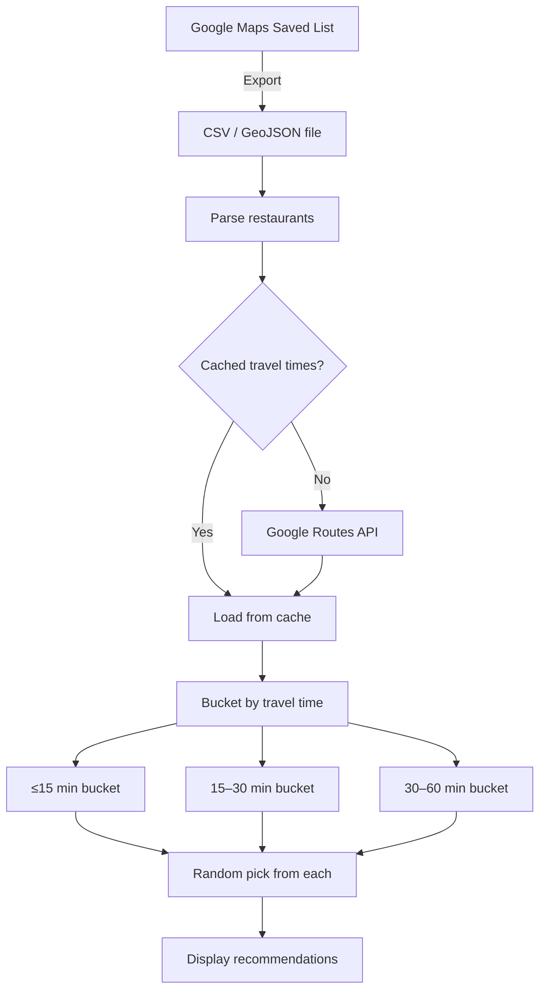
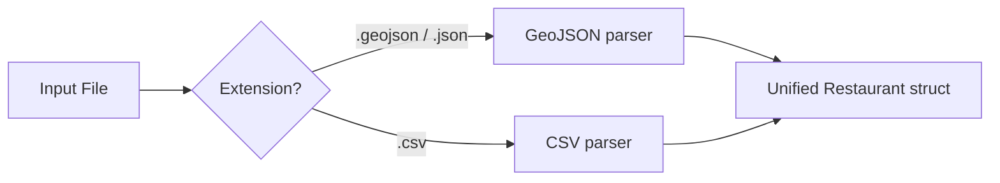
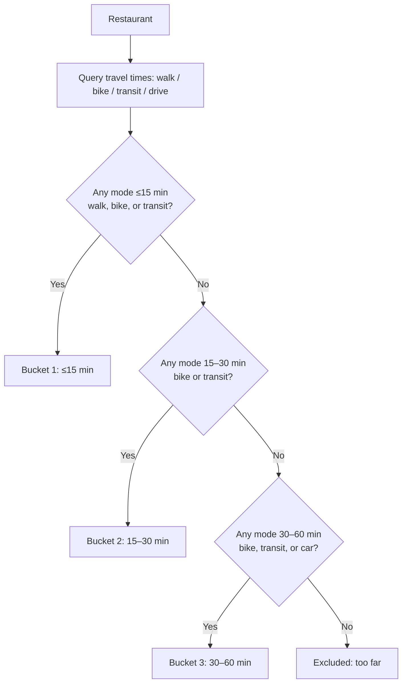
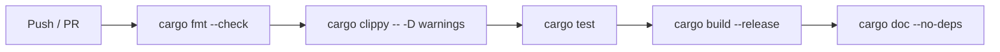
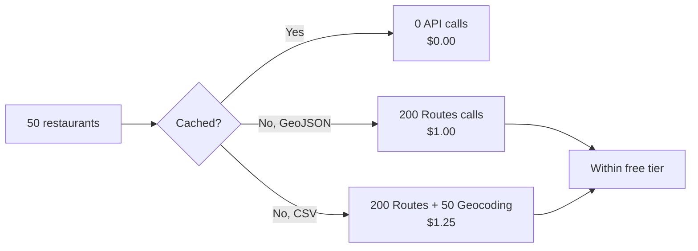

# Restaurant Roulette — Design Document

A CLI tool that randomly recommends restaurants from your Google Maps saved list, bucketed by travel time from home.

## 1. Problem Statement

You have a growing "want to try" restaurant list in Google Maps. When it's time to eat, decision fatigue kicks in. This tool picks three restaurants for you — one nearby, one mid-range, and one worth the trek — so you get variety without the agonizing scroll.

## 2. User Experience

```text
$ resto-roulette --home "123 Rue Saint-Denis, Montréal, QC"

🚶 Walk/Bike/Transit ≤15 min
   → Hà (Vietnamese · 243 Rue De Bleury)   ~12 min by transit

🚲 Bike/Transit 15–30 min
   → Nouveau Palais (Diner · 281 Rue Bernard O)   ~22 min by bike

🚗 Bike/Transit/Car 30–60 min
   → Cabane à sucre Au Pied de Cochon (Québécois · Mirabel)   ~48 min by car

Re-roll? [y/N]
```

### CLI Interface

| Flag | Description | Default |
|---|---|---|
| `--home` / `-h` | Home address or lat,lng | `$RESTO_HOME` env var |
| `--list` / `-l` | Path to exported list file | `saved_places.csv` |
| `--reroll` / `-r` | Interactive re-roll mode | off |
| `--format` | Output format: `pretty`, `json` | `pretty` |
| `--cache-ttl` | Hours to cache travel times | `168` (1 week) |
| `--dry-run` | Show buckets without API calls (uses cache only) | off |

## 3. Data Flow



## 4. Input: Getting Restaurants Out of Google Maps

Google Maps does not offer a clean one-click export of saved lists. There are two practical paths, and the tool should support both.

### Option A — Google Takeout (GeoJSON)

Go to [takeout.google.com](https://takeout.google.com), select **Saved > Maps (your places)**, and download. This produces a GeoJSON file per list. Each feature contains a `name`, `address`, and `geometry` (coordinates). This is the richest source and includes lat/lng, eliminating one geocoding call per restaurant.

### Option B — Manual CSV

For users who prefer control or have a curated subset, support a simple CSV:

```csv
name,address
Hà,243 Rue De Bleury Montréal QC
Nouveau Palais,281 Rue Bernard O Montréal QC
```

When coordinates are absent, the tool geocodes the address via the Google Geocoding API before computing travel times.

### Input Parsing Strategy



Both parsers produce a `Vec<Restaurant>`:

```rust
struct Restaurant {
    name: String,
    address: String,
    location: Option<LatLng>,  // present in GeoJSON, absent in CSV
}

struct LatLng {
    lat: f64,
    lng: f64,
}
```

## 5. Travel Time Calculation

### API Choice

Use the **Google Routes API** (`routes.googleapis.com`), which is the successor to the Directions API. It supports computing routes for multiple travel modes in a single request via `computeRoutes`, and is the API Google is actively investing in.

We need travel times for multiple modes per restaurant:

| Bucket | Modes to query |
|---|---|
| ≤15 min | Walking, Bicycling, Transit |
| 15–30 min | Bicycling, Transit |
| 30–60 min | Bicycling, Transit, Driving |

### Bucketing Logic

For each restaurant, query all four travel modes. Then assign the restaurant to the **closest** (shortest-time) bucket where at least one eligible mode falls within range:



A restaurant lands in exactly one bucket — the nearest one it qualifies for. This avoids the close-by spots dominating every bucket.

### Handling Ambiguity

A restaurant reachable in 14 min by transit *and* 25 min by bike goes into Bucket 1 (≤15 min), since it qualifies for the nearest bucket. The displayed recommendation shows the best qualifying mode and time for that bucket.

## 6. Caching

API calls are expensive (both in latency and cost). Travel times between a fixed home and a fixed restaurant don't change often, so aggressive caching makes sense.

### Cache Design

Use a local SQLite database (`~/.resto-roulette/cache.db`):

```sql
CREATE TABLE travel_times (
    restaurant_id TEXT NOT NULL,    -- SHA-256(name + address)
    home_id       TEXT NOT NULL,    -- SHA-256(home address)
    mode          TEXT NOT NULL,    -- walk | bike | transit | drive
    duration_secs INTEGER NOT NULL,
    fetched_at    TEXT NOT NULL,    -- ISO 8601
    PRIMARY KEY (restaurant_id, home_id, mode)
);
```

- **TTL**: Default 1 week (configurable via `--cache-ttl`).
- **Invalidation**: Entries older than TTL are re-fetched on next run. The `--dry-run` flag uses stale cache without refreshing.
- **Why SQLite**: Zero-config, single-file, great Rust support via `rusqlite`. No server process to manage.

## 7. Project Structure

```text
resto-roulette/
├── Cargo.toml
├── Cargo.lock
├── README.md
├── LICENSE
├── .github/
│   └── workflows/
│       └── ci.yml            # lint + test + build
├── src/
│   ├── main.rs               # CLI entry point (clap)
│   ├── lib.rs                 # Public API re-exports
│   ├── config.rs              # CLI args, env vars, config loading
│   ├── parse/
│   │   ├── mod.rs
│   │   ├── geojson.rs         # GeoJSON parser
│   │   └── csv.rs             # CSV parser
│   ├── routing/
│   │   ├── mod.rs
│   │   ├── client.rs          # Google Routes API HTTP client
│   │   └── models.rs          # API request/response types
│   ├── cache/
│   │   ├── mod.rs
│   │   └── sqlite.rs          # SQLite cache implementation
│   ├── bucket.rs              # Bucketing logic
│   ├── picker.rs              # Random selection from buckets
│   ├── display.rs             # Pretty + JSON output formatting
│   └── error.rs               # Unified error type (thiserror)
└── tests/
    ├── fixtures/
    │   ├── sample.geojson
    │   └── sample.csv
    ├── parse_test.rs           # Input parsing integration tests
    ├── bucket_test.rs          # Bucketing logic tests
    └── picker_test.rs          # Selection + distribution tests
```

## 8. Key Dependencies

| Crate | Purpose |
|---|---|
| `clap` | CLI argument parsing with derive macros |
| `reqwest` | HTTP client for Google APIs (async, rustls) |
| `serde` / `serde_json` | JSON serialization & GeoJSON parsing |
| `csv` | CSV parsing |
| `rusqlite` | SQLite cache (with `bundled` feature) |
| `tokio` | Async runtime |
| `rand` | Random selection from buckets |
| `thiserror` | Ergonomic error types |
| `sha2` | Cache key hashing |
| `chrono` | Timestamp handling for cache TTL |
| `colored` | Terminal coloring for pretty output |
| `tracing` | Structured logging |

## 9. Error Handling Strategy

Use a unified `AppError` enum via `thiserror`:

```rust
#[derive(Debug, thiserror::Error)]
pub enum AppError {
    #[error("Failed to parse input file: {0}")]
    Parse(String),

    #[error("Google API error: {0}")]
    Api(#[from] reqwest::Error),

    #[error("Cache error: {0}")]
    Cache(#[from] rusqlite::Error),

    #[error("No restaurants found in bucket: {bucket}")]
    EmptyBucket { bucket: String },

    #[error("Missing API key. Set GOOGLE_MAPS_API_KEY env var.")]
    MissingApiKey,

    #[error("{0}")]
    Config(String),
}
```

When a bucket is empty, the tool prints a friendly message for that slot rather than failing the entire run. The other two recommendations still display.

## 10. Testing Strategy

### Unit Tests

Embedded in each module via `#[cfg(test)]`:

- **Parsing**: Verify both GeoJSON and CSV parsers produce correct `Restaurant` structs from fixture files. Test edge cases (missing fields, unicode names, BOM in CSV).
- **Bucketing**: Given mock travel times, assert restaurants land in correct buckets. Test boundary conditions (exactly 15 min, exactly 30 min).
- **Picker**: Verify selection respects bucket constraints. Seed the RNG for deterministic tests.

### Integration Tests

In `tests/`:

- **End-to-end with mock API**: Use `wiremock` to stand up a fake Google Routes API. Feed a fixture list, assert the full output contains one pick per bucket.
- **Cache round-trip**: Write entries, read them back, verify TTL expiry.

### Property-Based Tests

Using `proptest`:

- Generated random lists of restaurants with random travel times always produce valid bucket assignments.
- Picker never returns duplicates across buckets.

### Test Fixtures

Checked into `tests/fixtures/`:
- `sample.geojson` — 10 restaurants in GeoJSON format
- `sample.csv` — same 10 restaurants as CSV
- `routes_response.json` — recorded Google API response for snapshot testing

## 11. CI Pipeline



GitHub Actions workflow covering:

1. **Format check** — `cargo fmt --check` (zero tolerance for unformatted code)
2. **Lint** — `cargo clippy -- -D warnings` (treat all warnings as errors)
3. **Test** — `cargo test` (unit + integration)
4. **Build** — `cargo build --release` (catch release-only issues)
5. **Docs** — `cargo doc --no-deps` (ensure doc comments compile)

Matrix: `stable` + `nightly` on `ubuntu-latest`.

## 12. Documentation

- **README.md**: Setup instructions, usage examples, API key configuration.
- **Doc comments**: Every public type and function gets `///` doc comments with examples where useful. Run `cargo doc --open` to browse.
- **CONTRIBUTING.md**: Dev setup, testing instructions, PR guidelines.
- **Architecture Decision Records** (in `docs/adr/`):
  - `001-rust.md` — Why Rust (performance, type safety, good async ecosystem; tradeoff: no official Google SDK).
  - `002-sqlite-cache.md` — Why SQLite over flat files or sled.
  - `003-routes-api.md` — Why Routes API over Directions API.

## 13. Configuration & Secrets

The Google Routes API requires an API key. The tool reads it from:

1. `--api-key` flag (highest priority, for scripts)
2. `GOOGLE_MAPS_API_KEY` environment variable (recommended for daily use)
3. `~/.resto-roulette/config.toml` (lowest priority)

```toml
# ~/.resto-roulette/config.toml
home = "123 Rue Saint-Denis, Montréal, QC"
api_key = "AIza..."
cache_ttl_hours = 168
default_format = "pretty"
```

The home address follows the same precedence: `--home` flag > `RESTO_HOME` env var > config file.

## 14. API Cost Analysis

### Pricing Model

The Google Routes API uses pay-as-you-go pricing with three SKU tiers, determined automatically by the features requested:

| SKU | Cost per 1,000 requests | Trigger |
|---|---|---|
| Basic | $5.00 | Simple route, polyline, ETA |
| Advanced | $10.00 | Waypoints, real-time traffic |
| Preferred | $15.00 | Two-wheeler routing, traffic polylines |

This tool only needs basic travel durations — no traffic-aware routing, no polylines, no waypoints — so all requests fall under the **Basic SKU at $5.00 per 1,000 requests**.

If using CSV input (no coordinates), the Geocoding API is also needed at **$5.00 per 1,000 requests**.

### Free Tier

Google Maps Platform provides free monthly usage per SKU: **10,000 free events for Essentials SKUs** (which includes both Basic Compute Routes and Geocoding). This resets monthly.

### Cost Estimate Per Run

For a list of **N** restaurants with an empty cache:

| API Call | Count | SKU | Cost |
|---|---|---|---|
| Compute Routes (4 modes × N restaurants) | 4N | Basic | 4N × $0.005 |
| Geocoding (CSV only, once per restaurant) | N | Essentials | N × $0.005 |

**Worked example — 50 restaurants, fresh cache, CSV input:**

| | Requests | Cost |
|---|---|---|
| Routes | 200 | $1.00 |
| Geocoding | 50 | $0.25 |
| **Total** | **250** | **$1.25** |

This is well within the 10,000 free monthly events — **effectively $0.00**.

### Cost With Caching

The cache (default TTL: 1 week) means the API is only hit when:

- A new restaurant is added to the list.
- The cache expires (after 1 week by default).
- The home address changes.

Typical usage pattern — running the tool daily with a stable 50-restaurant list — would result in roughly **one billable batch per week** (200–250 requests). Over a month that's ~1,000 requests, still comfortably inside the free tier.

### When Costs Could Become Non-Zero

You'd need to exceed 10,000 Essentials events in a month. That corresponds to roughly **2,500 restaurants with a fresh cache**, or running without caching against a 50-restaurant list ~50 times in a month. For a personal tool, this is unlikely.

### Cost Guardrails

Even so, the design includes safeguards:

- **SQLite cache** with configurable TTL eliminates redundant API calls.
- **`--dry-run` flag** uses only cached data with zero API calls.
- **Google Cloud Console daily quota limits** can be set as a hard spending cap (recommended: set to $0 or $1/day).
- **GeoJSON input preferred** — coordinates are already present, eliminating geocoding calls entirely.



## 15. Language Choice: Why Rust Works (and Tradeoffs)

**Strengths for this project:**

- `serde` makes parsing GeoJSON/CSV/JSON API responses ergonomic and type-safe.
- `clap` derive macros produce polished CLIs with minimal boilerplate.
- `rusqlite` with the `bundled` feature compiles SQLite from source — zero system dependencies.
- Single static binary: `cargo build --release` produces one file you can drop anywhere.
- Strong error handling via `Result` + `thiserror` prevents silent failures.

**Tradeoffs to be aware of:**

- No official Google Maps Rust SDK — we use the REST API directly via `reqwest`. This means hand-writing request/response structs, but it also means zero SDK bloat.
- Compile times are slower than Go or Python. Mitigated by using `cargo check` during development.
- Smaller ecosystem for geospatial utilities compared to Python (no `geopy` equivalent), though we only need basic lat/lng handling.

**Verdict**: Rust is a good fit. The project is I/O-bound (API calls), not compute-bound, so raw performance isn't the selling point — but the type safety, single-binary distribution, and excellent CLI tooling (`clap`) make it a strong choice for a personal tool you'll use for years.

## 16. Future Enhancements

These are out of scope for v1 but worth noting:

- **Cuisine filter**: `--cuisine japanese` to restrict picks.
- **Time-of-day awareness**: Skip restaurants that are closed right now (requires Google Places API).
- **History tracking**: Don't recommend the same place within N days.
- **Multi-destination mode**: "Plan a food crawl" — pick 3 restaurants that form a reasonable route.
- **TUI mode**: Interactive terminal UI with `ratatui` for browsing buckets and re-rolling individual slots.
