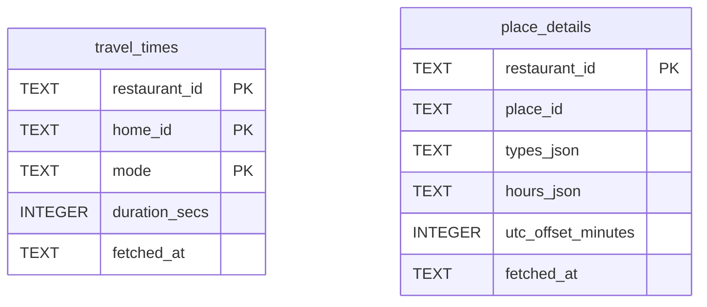
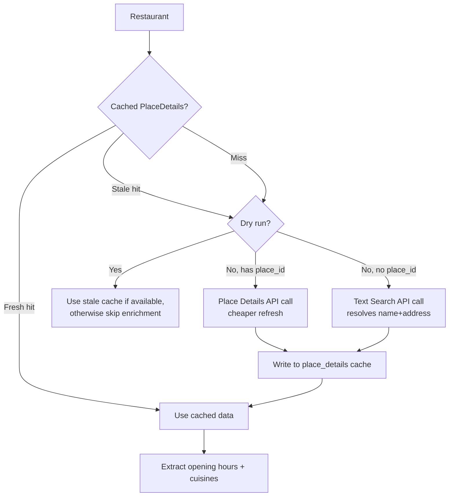
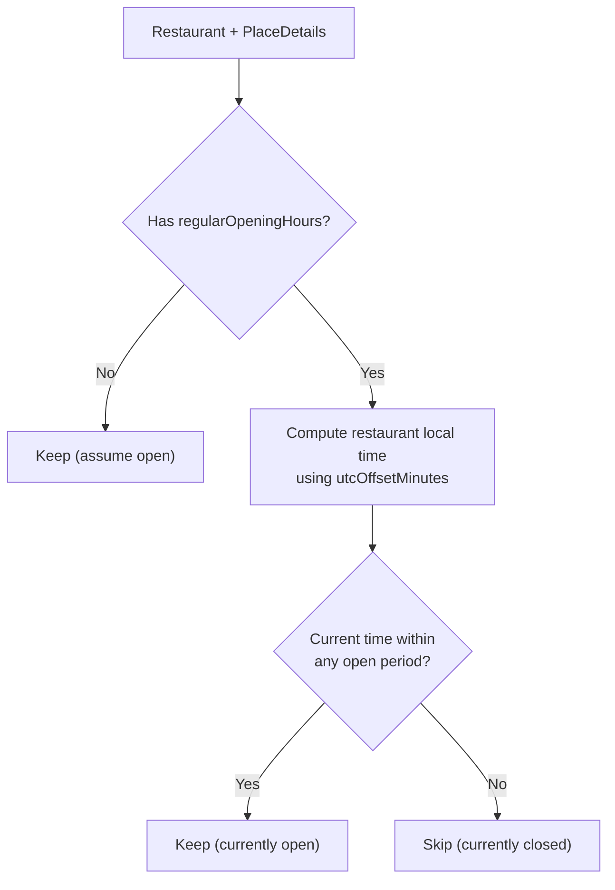
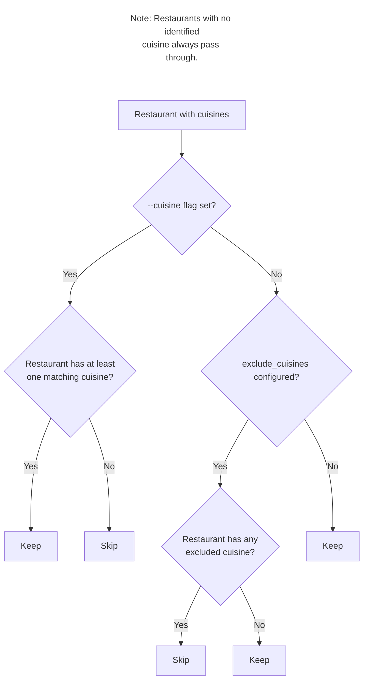
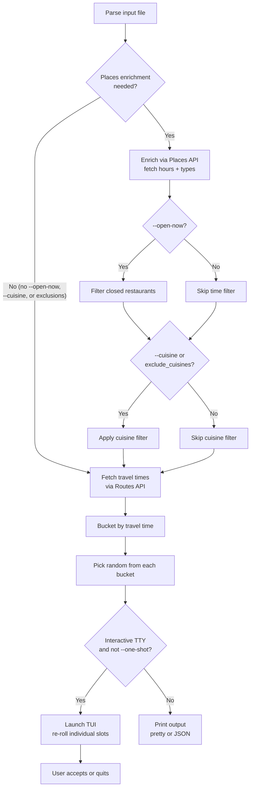

# Restaurant Roulette — Phase 2 Design Document

Phase 2 adds three features identified as future enhancements in the [original design doc](initial-design-doc.md#16-future-enhancements):

1. **Time-of-day awareness** — skip restaurants that are currently closed.
2. **Cuisine awareness** — display, filter, and exclude by cuisine type.
3. **Enhanced interactive mode** — a `ratatui`-powered TUI replacing the text-based re-roll prompt.

Each feature is implemented independently, in order. Features 1 and 2 share a common Google Places API integration layer that is introduced with Feature 1.

---

## 1. Shared Infrastructure: Google Places API

### Why a New API?

The v1 pipeline uses only the Google Routes API (for travel times). Opening hours and cuisine types are not available from Routes — they come from the **Google Places API (New)**.

Both Feature 1 (opening hours) and Feature 2 (cuisine types) need the same Places API data, so a single enrichment step serves both features.

### API Strategy

**First encounter** (no cached place ID): use **Text Search (New)** to resolve a restaurant's name + address into a Place ID, opening hours, and place types — all in one call.

```
POST https://places.googleapis.com/v1/places:searchText

Headers:
  X-Goog-Api-Key: <key>
  X-Goog-FieldMask: places.id,places.types,places.regularOpeningHours,places.utcOffsetMinutes,places.displayName

Body:
  { "textQuery": "Restaurant Name, Address", "maxResultCount": 1 }
```

**Subsequent refreshes** (place ID cached): use **Place Details (New)** with the cached Place ID, which is significantly cheaper.

```
GET https://places.googleapis.com/v1/places/{place_id}

Headers:
  X-Goog-Api-Key: <key>
  X-Goog-FieldMask: types,regularOpeningHours,utcOffsetMinutes
```

The `regularOpeningHours` and `types` fields are **Basic SKU** data — they do not trigger the more expensive Preferred or Advanced tiers.

### API Key

The same `--api-key` / `GOOGLE_MAPS_API_KEY` credential is used for both Routes and Places APIs. The user must ensure the key has the **Places API (New)** enabled in their Google Cloud project. If a 403 is returned, the error message should mention this.

### Caching

Place details change infrequently (hours and cuisine type are relatively stable), so they are cached with a **30-day default TTL**, independent of the travel-times TTL.

New `place_details` table in the existing SQLite database (`~/.resto-roulette/cache.db`):

```sql
CREATE TABLE IF NOT EXISTS place_details (
    restaurant_id      TEXT PRIMARY KEY,  -- same SHA-256 key as travel_times
    place_id           TEXT NOT NULL,     -- Google Place ID for cheaper refreshes
    types_json         TEXT NOT NULL,     -- JSON array, e.g. ["japanese_restaurant","restaurant"]
    hours_json         TEXT,              -- JSON-serialized WeeklyHours, NULL if unavailable
    utc_offset_minutes INTEGER,           -- restaurant's UTC offset for local time computation
    fetched_at         TEXT NOT NULL      -- ISO 8601
);
```



A configurable TTL flag `--places-cache-ttl` (default 720 hours / 30 days) controls expiry. The existing `--cache-ttl` continues to control travel-time cache only.

### Enrichment Flow



Concurrency: `buffer_unordered(5)` for Places API calls (lower than the Routes concurrency of 10, as Text Search is heavier).

### Lazy Enrichment

The Places API is **only called when needed**. If neither `--open-now` nor `--cuisine` is active (and `exclude_cuisines` is empty), the enrichment step is skipped entirely and the pipeline behaves identically to v1.

---

## 2. Feature 1: Time-of-Day Awareness

### Motivation

A restaurant recommendation isn't useful if the place is closed. This opt-in mode filters out currently-closed restaurants before picking.

### User Experience

```
$ resto-roulette --home "123 Rue Saint-Denis" --open-now

Skipped 3 closed restaurants.

🚶 Walk/Bike/Transit ≤15 min
   → Hà (243 Rue De Bleury)   ~12 min by transit

🚲 Bike/Transit 15–30 min
   → Nouveau Palais (281 Rue Bernard O)   ~22 min by bike

🚗 Bike/Transit/Car 30–60 min
   → Joe Beef (2491 Rue Notre-Dame O)   ~38 min by car

Re-roll? [y/N]
```

### CLI & Config

| Source | Key | Type | Default |
|--------|-----|------|---------|
| Flag | `--open-now` | `bool` | `false` |
| Config | `open_now` | `bool` | `false` |

The flag and config option follow the existing precedence: flag overrides config. Since this is a boolean opt-in, no env var is needed.

### Pipeline Insertion Point

Filtering happens **before** travel-time fetching. This is intentional — it avoids wasting Routes API calls on restaurants that will be discarded anyway.

```
Parse → Enrich (Places API) → Filter closed → Fetch travel times → Bucket → Pick → Display
```

### Open-Now Logic

The `regularOpeningHours` field from the Places API provides weekly recurring hours. Combined with the restaurant's `utcOffsetMinutes`, the app computes local time at the restaurant and checks whether it falls within any open period.



**Data model for opening hours:**

```rust
pub struct WeeklyHours {
    pub periods: Vec<HoursPeriod>,
}

pub struct HoursPeriod {
    pub open: DayTime,
    pub close: Option<DayTime>,  // None = open 24 hours
}

pub struct DayTime {
    pub day: u8,     // 0 = Sunday, 6 = Saturday
    pub hour: u8,    // 0–23
    pub minute: u8,  // 0–59
}
```

The `is_open_at` function:

```rust
/// Determine whether a restaurant is open at a given UTC time,
/// using the restaurant's UTC offset to compute local time.
pub fn is_open_at(hours: &WeeklyHours, utc_offset_minutes: i32, now_utc: DateTime<Utc>) -> bool
```

This avoids depending on the system timezone — it uses the restaurant's own UTC offset from the Places API, which is correct even when travelling.

### Edge Cases

| Scenario | Behavior |
|----------|----------|
| No `regularOpeningHours` in API response | Assume open (fail-open) |
| Places API call fails for one restaurant | Log warning, keep restaurant (fail-open) |
| Dry-run with no cached place details | Keep restaurant (cannot determine status) |
| Dry-run with stale cached place details | Use stale data for filtering |
| Midnight rollover (e.g., open 22:00–02:00) | Handle cross-day periods correctly |
| 24-hour restaurant (`close` is `None`) | Always open |
| All restaurants filtered out | Display message: "No open restaurants found. Try without --open-now." |

### Error Handling

- Individual restaurant Places API failures are **non-fatal** (logged at `warn` level, restaurant kept).
- API key missing the Places API scope (403) bubbles up as `AppError::PlacesApi` with a message suggesting the user enable the Places API (New) on their Google Cloud project.

---

## 3. Feature 2: Cuisine Awareness

### Motivation

Three user needs:
1. **See** what kind of food a restaurant serves in the output.
2. **Filter** to a specific cuisine when you're in the mood for something particular.
3. **Exclude** cuisines you never want recommended (e.g., fast food) without having to specify every time.

### User Experience

**Display (always, when enrichment data is available):**

```
🚶 Walk/Bike/Transit ≤15 min
   → Hà (Vietnamese · 243 Rue De Bleury)   ~12 min by transit

🚲 Bike/Transit 15–30 min
   → Nouveau Palais (Diner · 281 Rue Bernard O)   ~22 min by bike

🚗 Bike/Transit/Car 30–60 min
   → Cabane à sucre Au Pied de Cochon (Québécois · Mirabel)   ~48 min by car
```

Cuisine appears between the restaurant name and address, separated by ` · `. If a restaurant has multiple cuisines, the first (most specific) is shown in pretty output. If no cuisine is identified, the display is unchanged from v1.

**Filtering:**

```
$ resto-roulette --home "123 Rue Saint-Denis" --cuisine japanese
$ resto-roulette --home "123 Rue Saint-Denis" --cuisine "japanese,korean"
```

**Exclusion (config file):**

```toml
# ~/.resto-roulette/config.toml
exclude_cuisines = ["fast_food", "pizza"]
```

### CLI & Config

| Source | Key | Type | Default |
|--------|-----|------|---------|
| Flag | `--cuisine` | `Vec<String>` (comma-delimited) | None (no filter) |
| Config | `exclude_cuisines` | `Vec<String>` | `[]` |

No env var for either — these are not secrets and are unlikely to vary per shell session.

### Cuisine Taxonomy

Google Places types include entries like `japanese_restaurant`, `italian_restaurant`, `seafood_restaurant`, etc. These are mapped to user-friendly short names:

| Google Places type | Display name |
|---|---|
| `japanese_restaurant` | Japanese |
| `chinese_restaurant` | Chinese |
| `italian_restaurant` | Italian |
| `mexican_restaurant` | Mexican |
| `thai_restaurant` | Thai |
| `indian_restaurant` | Indian |
| `french_restaurant` | French |
| `korean_restaurant` | Korean |
| `vietnamese_restaurant` | Vietnamese |
| `greek_restaurant` | Greek |
| `turkish_restaurant` | Turkish |
| `lebanese_restaurant` | Lebanese |
| `seafood_restaurant` | Seafood |
| `steak_house` | Steakhouse |
| `pizza_restaurant` | Pizza |
| `sushi_restaurant` | Sushi |
| `hamburger_restaurant` | Burger |
| `barbecue_restaurant` | Barbecue |
| `ramen_restaurant` | Ramen |
| `brunch_restaurant` | Brunch |
| `vegan_restaurant` | Vegan |
| `vegetarian_restaurant` | Vegetarian |
| `fast_food_restaurant` | Fast food |
| `cafe` | Cafe |
| `bakery` | Bakery |

Non-cuisine types (e.g., `point_of_interest`, `establishment`) are ignored. The mapping function returns `None` for unrecognized types, making it easy to extend.

The `--cuisine` flag and `exclude_cuisines` config use the **display name** (lowercase), not the raw Google type. This keeps the user-facing interface readable.

### Filtering Rules



Key rules:
- **`--cuisine` overrides `exclude_cuisines`**: if you explicitly ask for pizza, the exclusion list doesn't block it.
- **No cuisine = no filter**: restaurants with no recognized cuisine type are never excluded by cuisine filters. They can only be excluded by explicit name/address filtering (out of scope).
- **Multiple cuisines on a restaurant**: a restaurant matches if *any* of its cuisines match the filter.

### Display Changes

**Pretty output** (`src/display.rs`):

```
→ Name (Cuisine · Address)   ~X min by mode
→ Name (Address)             ~X min by mode   // when no cuisine
```

The first (most specific) cuisine is displayed. Title-cased for readability.

**JSON output**:

```json
{
  "near": {
    "name": "Hà",
    "address": "243 Rue De Bleury",
    "cuisines": ["vietnamese"],
    "bucket": "≤15 min",
    "best_mode": "transit",
    "best_secs": 720
  }
}
```

The `cuisines` field is an array containing all matched cuisines (not just the first). It is present even when empty (`[]`), for consistent JSON structure.

### Carrying Cuisine Data Through the Pipeline

The `BucketEntry` struct gains a `cuisines` field:

```rust
pub struct BucketEntry {
    pub restaurant: Restaurant,
    pub bucket: Bucket,
    pub best_secs: u32,
    pub best_mode: TravelMode,
    pub cuisines: Vec<String>,   // NEW — normalized cuisine names
}
```

The `bucket::assign` function signature changes to accept a map of restaurant ID to cuisine list, alongside the existing travel-times map. This keeps the `Restaurant` struct unchanged and avoids rippling changes through all parsers.

---

## 4. Feature 3: Enhanced Interactive Mode

### Motivation

The current re-roll experience is a simple "Re-roll? [y/N]" text prompt that re-rolls all three buckets at once. This is limiting:

- You can't keep a pick you like and re-roll only the others.
- You can't see cuisine or open status at a glance during re-rolling.
- The plain-text prompt doesn't leverage the terminal's capabilities.

### User Experience

When the app runs in interactive mode (i.e., `--one-shot` is not set), the current text-based re-roll prompt is replaced with a `ratatui`-powered TUI.

**Layout:**

```
┌─────────────────────────────────────────────────────┐
│  resto-roulette                                     │
├─────────────────────────────────────────────────────┤
│                                                     │
│  🚶 Walk/Bike/Transit ≤15 min                      │
│  ► Hà (Vietnamese · 243 Rue De Bleury)              │
│    ~12 min by transit                               │
│                                                     │
│  🚲 Bike/Transit 15–30 min                          │
│  ► Nouveau Palais (Diner · 281 Rue Bernard O)       │
│    ~22 min by bike                                  │
│                                                     │
│  🚗 Bike/Transit/Car 30–60 min                      │
│  ► Joe Beef (Québécois · 2491 Rue Notre-Dame O)     │
│    ~38 min by car                                   │
│                                                     │
├─────────────────────────────────────────────────────┤
│  ↑↓ Navigate   r Re-roll slot   R Re-roll all      │
│  Enter Accept   q Quit                              │
└─────────────────────────────────────────────────────┘
```

### Keybindings

| Key | Action |
|-----|--------|
| `↑` / `k` | Move selection to previous bucket |
| `↓` / `j` | Move selection to next bucket |
| `r` | Re-roll the selected bucket only |
| `R` | Re-roll all three buckets |
| `Enter` | Accept current selection and exit |
| `q` / `Esc` | Quit without accepting |

### Integration with Features 1 & 2

- **Cuisine**: displayed inline in each slot (as shown in the layout above).
- **Open status**: when `--open-now` is active, closed restaurants are already filtered before bucketing, so the TUI only shows open restaurants. No additional indicator is needed in the TUI itself.

### Technical Approach

- **Crate**: `ratatui` (with `crossterm` backend) — the de facto standard for Rust terminal UIs.
- **New module**: `src/tui/mod.rs` — contains the TUI app loop, layout, rendering, and input handling.
- **State**: the TUI holds a reference to the `Buckets` struct and maintains its own `Selection` that can be re-rolled per-bucket via `picker::pick_one`.
- **`--one-shot` / `-o`**: bypasses the TUI entirely — prints the initial pick to stdout (pretty or JSON) and exits, same as v1 behavior.
- **`--format json`**: also bypasses the TUI — JSON output is for machine consumption and should not launch an interactive UI. The initial pick is printed as JSON and the app exits.
- **Non-interactive terminals**: if stdout is not a TTY, fall back to the v1 non-interactive display (print once and exit). This ensures piping works: `resto-roulette | jq .`.

### Picker Changes

The current `picker::pick_random` returns a `Selection` (one pick per bucket). For per-bucket re-rolling, a new function is needed:

```rust
/// Pick a single random entry from the given bucket's candidate list.
pub fn pick_one(candidates: &[BucketEntry]) -> Option<&BucketEntry>
```

The TUI calls `pick_one` on the relevant bucket when the user presses `r`.

### Future TUI Enhancements

These are out of scope for phase 2 but worth noting for future phases:

- **Full browsable TUI**: scroll through all candidates in each bucket before confirming a pick, rather than relying on random selection.
- **TUI explorer mode**: a full-screen restaurant browser organized by bucket, with search, sorting, and detail panels — essentially turning the tool into an interactive restaurant explorer.

---

## 5. Updated Pipeline



---

## 6. New & Modified Modules

| File | Action | Description |
|------|--------|-------------|
| `src/places/mod.rs` | **New** | Module root, re-exports |
| `src/places/client.rs` | **New** | Places API HTTP client (Text Search + Place Details) |
| `src/places/models.rs` | **New** | `PlaceDetails`, `WeeklyHours`, `HoursPeriod`, `DayTime` structs |
| `src/places/hours.rs` | **New** | `is_open_at` logic |
| `src/places/cuisine.rs` | **New** | Taxonomy mapping, `extract_cuisines` |
| `src/tui/mod.rs` | **New** | TUI app loop, layout, rendering, input handling |
| `src/lib.rs` | Modify | Add `pub mod places;` and `pub mod tui;` |
| `src/config.rs` | Modify | Add `--open-now`, `--cuisine`, `--places-cache-ttl`, `exclude_cuisines` |
| `src/cache/sqlite.rs` | Modify | Add `place_details` table, `get/put/evict` methods |
| `src/bucket.rs` | Modify | Add `cuisines` field to `BucketEntry` |
| `src/picker.rs` | Modify | Add `pick_one` for per-bucket re-rolling |
| `src/display.rs` | Modify | Show cuisine in pretty + JSON output |
| `src/error.rs` | Modify | Add `PlacesApi` variant |
| `src/main.rs` | Modify | Add enrichment/filtering step; TUI launch logic |
| `Cargo.toml` | Modify | Add `ratatui` and `crossterm` dependencies |

---

## 7. API Cost Analysis

### Google Places API (New) Pricing

| SKU | Cost per 1,000 calls | Free tier |
|-----|---------------------|-----------|
| Text Search (Basic) | $32.00 | — |
| Place Details (Basic) | $0.00 | First 10,000/month |

The `regularOpeningHours`, `types`, and `utcOffsetMinutes` fields are all available at the **Basic** tier. The field mask must be set correctly to avoid triggering a higher-cost SKU.

### Cost Estimate (50-restaurant list)

| Scenario | Text Search | Place Details | Cost |
|----------|------------|---------------|------|
| First run (empty cache) | 50 calls | 0 | ~$1.60 |
| Daily runs for a month | 0 (cached) | 0 (cached) | $0.00 |
| Monthly cache refresh | 0 | 50 (free tier) | $0.00 |
| **Total per month** | **50** | **50** | **~$1.60** |

Combined with Routes API costs (~$1.00/month for typical usage), total monthly cost remains under $3.00.

### Cost Optimization

1. **Cache place IDs**: Text Search ($0.032/call) is only used on first encounter. Subsequent refreshes use Place Details (free at Basic tier).
2. **30-day TTL**: opening hours and cuisine types rarely change, so a long cache TTL is appropriate.
3. **Lazy enrichment**: Places API is not called at all unless `--open-now` or `--cuisine` features are used.
4. **Minimal field mask**: always request only the fields needed to stay on the Basic SKU.

---

## 8. Migration & Backwards Compatibility

### Database

The new `place_details` table is created with `CREATE TABLE IF NOT EXISTS`, the same pattern used for `travel_times`. No migration of existing data is needed — this is purely additive.

### CLI

All new flags are opt-in with backward-compatible defaults:

| Flag | Default | Effect when not set |
|------|---------|-------------------|
| `--open-now` | `false` | No time filtering, no Places API calls |
| `--cuisine` | None | No cuisine filtering |
| `--places-cache-ttl` | `720` hours | Only relevant when Places API is used |

The `exclude_cuisines` config option defaults to an empty list.

### Output

- **Pretty**: cuisine appears between name and address only when enrichment data is available. Output is visually identical to v1 when no enrichment is performed.
- **JSON**: the `cuisines` field is added to each entry. This is a non-breaking addition for JSON consumers (new fields are ignored by parsers that don't expect them).
- **TUI**: only activates for interactive terminals when `--one-shot` is not set. Piped/non-TTY output falls back to v1 behavior.

### API Key

Users of the new features must ensure their Google Cloud API key has the **Places API (New)** enabled. A clear error message guides them if this is not the case. Users who don't use the new features are unaffected.

---

## 9. Phased Implementation

The three features are implemented in order, each building on the previous:

### Phase 2a: Time-of-Day Awareness ✅ Implemented

Introduces the shared Places API infrastructure and the `--open-now` feature.

1. ✅ Create `src/places/` module with client, models, and hours logic.
2. ✅ Add `place_details` table to the cache.
3. ✅ Add `--open-now` flag and `open_now` config option.
4. ✅ Add enrichment + open-now filtering step in `main.rs` (before travel-time fetching).
5. ✅ Add `PlacesApi` error variant.

### Phase 2b: Cuisine Awareness ✅ Implemented

Builds on the Places API infrastructure from 2a to add cuisine display and filtering.

1. ✅ Add `src/places/cuisine.rs` with taxonomy mapping (~60 Google Places types).
2. ✅ Add `--cuisine` flag and `exclude_cuisines` config option.
3. ✅ Add `cuisines` field to `BucketEntry`; update `bucket::assign` to accept cuisine data.
4. ✅ Add cuisine filtering logic in the enrichment step.
5. ✅ Update `display.rs` for cuisine in both pretty and JSON output.

**Implementation notes:**
- The taxonomy covers ~60 types observed in practice, significantly more than the 25 in the original design. Extended to cover `brewpub`, `bistro`, `diner`, `tapas_restaurant`, `coffee_shop`, and many more based on actual Places API responses.
- Pretty output omits the address when it equals the restaurant name (shared-list CSV format), showing just `→ Name (Cuisine)` instead of `→ Name (Cuisine · Name)`.

### Phase 2c: Enhanced Interactive Mode

Replaces the text-based re-roll with a `ratatui` TUI.

1. Add `ratatui` and `crossterm` dependencies.
2. Create `src/tui/mod.rs` with app loop, layout, rendering, and input handling.
3. Add `pick_one` to `src/picker.rs` for per-bucket re-rolling.
4. Update `main.rs` to launch TUI when interactive, fall back to print for `--one-shot`, `--format json`, and non-TTY.
5. Remove the old text-based re-roll loop from `main.rs`.

---

## 10. Testing Strategy

### Feature 1: Time-of-Day Awareness

**Unit tests** (`src/places/hours.rs`):
- Open during weekday lunch: returns `true`.
- Closed at 3 AM: returns `false`.
- 24-hour restaurant (no `close`): always returns `true`.
- Midnight rollover (open 22:00–02:00): correctly spans days.
- Different UTC offsets: verifies timezone math.
- Edge: exactly at opening/closing time.

**Integration tests**:
- `wiremock` fake for Places Text Search API response.
- End-to-end: parse -> enrich -> filter -> verify correct restaurants remain.
- Cache round-trip: write `PlaceDetails`, read back, verify fields.

**Test fixtures** to add:
- `tests/fixtures/places_text_search_response.json`
- `tests/fixtures/places_details_response.json`

### Feature 2: Cuisine Awareness

**Unit tests** (`src/places/cuisine.rs`):
- Known Google type maps to correct display name.
- Unknown type returns `None`.
- Multiple types extract multiple cuisines.
- Non-cuisine types (e.g., `point_of_interest`) are filtered out.

**Unit tests** (filtering logic):
- `--cuisine japanese` keeps only Japanese restaurants.
- `--cuisine "japanese,italian"` keeps both.
- `exclude_cuisines = ["fast_food"]` removes fast food.
- `--cuisine fast_food` overrides exclusion list.
- Restaurants with no cuisine pass through all filters.

**Unit tests** (`src/display.rs`):
- Pretty output includes cuisine when present.
- Pretty output unchanged when cuisine is empty.
- JSON output includes `cuisines` array.

### Feature 3: Enhanced Interactive Mode

**Unit tests** (`src/picker.rs`):
- `pick_one` returns a valid entry from the candidate list.
- `pick_one` on an empty list returns `None`.

**TUI tests** (`src/tui/`):
- Render test: verify the TUI renders without panicking given a known `Selection`.
- `ratatui` provides a `TestBackend` for headless rendering assertions.
- Input handling: simulate keypress sequences and verify state changes (selected bucket, re-roll triggers).

**Manual testing checklist**:
- Verify TUI launches on interactive terminal.
- Verify `--one-shot` bypasses TUI.
- Verify `--format json` bypasses TUI.
- Verify piping (`| cat`) bypasses TUI.
- Verify `j`/`k`/arrow navigation.
- Verify `r` re-rolls only the selected bucket.
- Verify `R` re-rolls all buckets.
- Verify `q`/`Esc` exits cleanly (terminal restored).
- Verify `Enter` prints final selection and exits.
