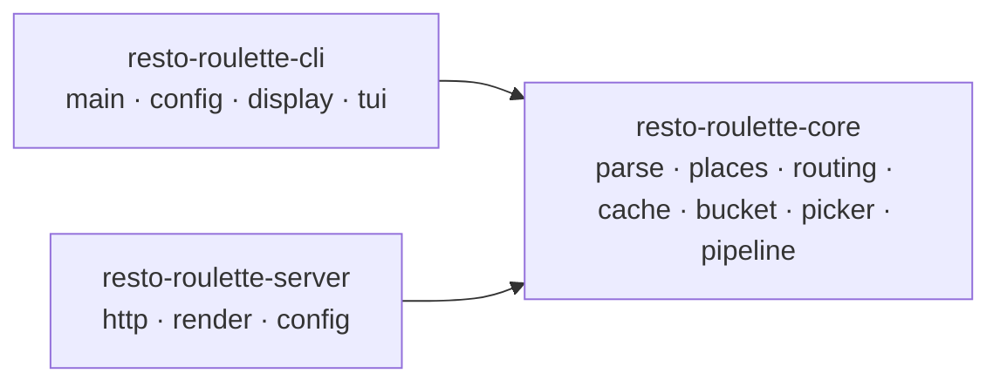
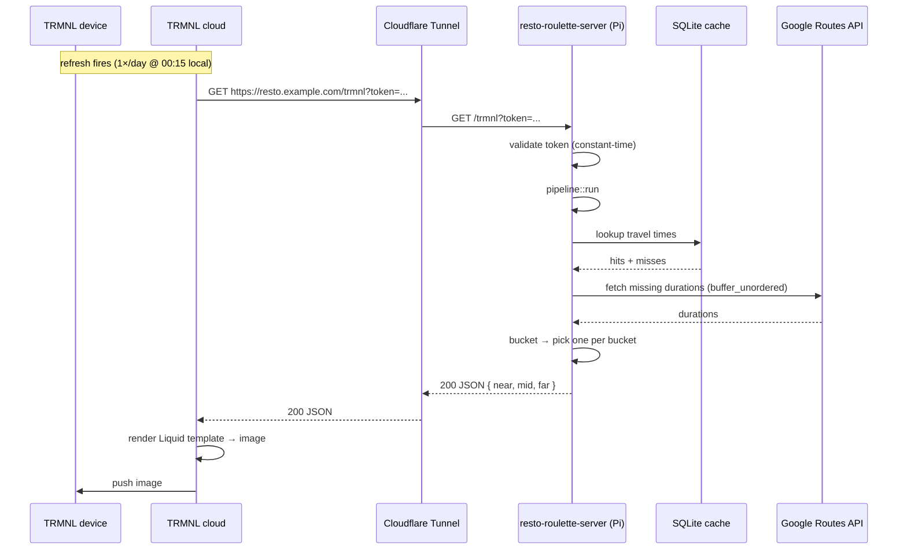

# Restaurant Roulette — Phase 3 Design Document

Phase 3 ships [`resto-roulette-server`](#4-phase-3b-resto-roulette-server), a sibling binary that serves the picker output as a [TRMNL](https://usetrmnl.com) e-ink plugin, and the workspace refactor that makes it possible.

This doc supersedes the exploratory [`server-exploration.md`](server-exploration.md) — decisions that were open there are locked here.

The work splits into two milestones:

1. **Phase 3a** — refactor the single crate into a Cargo workspace with a shared `resto-roulette-core` library. No behavior change; CLI parity is the bar.
2. **Phase 3b** — build `resto-roulette-server` on top of the core crate. New axum HTTP server, deployed to a Raspberry Pi behind Cloudflare Tunnel.

---

## 1. Goals & Non-Goals

### Goals (v1)

- A small HTTP server that, on each request, runs the existing pipeline once and returns picks for all three buckets (Near / Mid / Far) so they render simultaneously on a TRMNL e-ink screen.
- Single-tenant: one home address, one restaurant list, one TRMNL device.
- Static restaurant list on disk — same GeoJSON / CSV formats the CLI already understands. Dynamic list ingestion is a path forward (see [`list-ingestion-exploration.md`](list-ingestion-exploration.md)).
- Cargo workspace shared between CLI and server, with a `resto-roulette-core` library holding the pipeline.
- Single static `aarch64-unknown-linux-musl` binary suitable for a home Raspberry Pi.

### Non-Goals (v1)

- **Multi-tenant / per-device config.** Outlined in §9, not built.
- **`--open-now` and `--cuisine` filters on the server.** The server pipeline runs bucketing only — no Places API calls. Cuisine labels are still surfaced when present in the cache (zero-cost passthrough), mirroring the CLI's TUI behavior.
- **Any interactive UI.** No analogue of the TUI; the device has no input surface.
- **Server-side caching of picks across requests.** Every request re-rolls statelessly. Cadence is owned by TRMNL's per-plugin refresh setting.
- **Hot-reloading config.** Server reads `server.toml` once at startup; restart on change.
- **Public marketplace listing on TRMNL.**

---

## 2. TRMNL Plugin Model

TRMNL supports several plugin types. The relevant ones:

| Type | How content gets to the device | Decision |
|---|---|---|
| **Private Plugin (Polling)** | TRMNL polls a URL you control. Endpoint returns JSON, rendered through a Liquid template hosted on TRMNL. | **Chosen.** Matches our model exactly — stateless, server-side generation per refresh. |
| Private Plugin (Webhook) | Server *pushes* data to TRMNL when state changes. | Wrong direction — picks are randomized at request time, no event to push from. |
| BYOS (Bring Your Own Server) | Replaces TRMNL's whole rendering pipeline. | Far more than we need; loses templating and refresh-rate management. |

**Refresh cadence.** Set the per-plugin refresh to **1×/day at 00:15 local** (TRMNL's daily preset). The server is stateless and re-rolls on every request, so cadence is entirely TRMNL-side configuration. No server-side scheduling required.

References:
- [TRMNL — Compare custom plugin types](https://help.trmnl.com/en/articles/10546870-compare-custom-plugin-types)
- [TRMNL — How refresh rates work](https://help.trmnl.com/en/articles/10113695-how-refresh-rates-work)
- [TRMNL — Private Plugins](https://help.trmnl.com/en/articles/9510536-private-plugins)

---

## 3. Phase 3a: Workspace Refactor

The bulk of the implementation risk lives here. The refactor is a no-behavior-change rearrangement; CLI parity is the acceptance bar.

### Workspace Layout

```text
resto-roulette/
├── Cargo.toml                    # workspace manifest
├── Cargo.lock
├── crates/
│   ├── resto-roulette-core/
│   │   ├── Cargo.toml
│   │   └── src/
│   │       ├── lib.rs            # re-exports
│   │       ├── pipeline.rs       # NEW: extracted from current main.rs
│   │       ├── parse/            # moved
│   │       ├── places/           # moved
│   │       ├── routing/          # moved
│   │       ├── cache/            # moved
│   │       ├── bucket.rs         # moved
│   │       ├── picker.rs         # moved
│   │       └── error.rs          # moved (variants stay here)
│   ├── resto-roulette-cli/
│   │   ├── Cargo.toml
│   │   └── src/
│   │       ├── main.rs           # shrinks to: parse args → pipeline::run → display/TUI
│   │       ├── config.rs         # CLI-shaped config (file/env/flag)
│   │       ├── display.rs        # pretty + JSON formatters
│   │       └── tui/              # moved unchanged
│   └── resto-roulette-server/
│       ├── Cargo.toml
│       └── src/
│           └── main.rs           # placeholder in 3a; real impl in 3b
└── docs/
```

### Crate Dependency Graph



### Module Migration

Use `git mv` to preserve file history.

| Source (today) | Destination | Notes |
|---|---|---|
| `src/parse/` | `crates/resto-roulette-core/src/parse/` | Verbatim. |
| `src/places/` | `crates/resto-roulette-core/src/places/` | Verbatim. |
| `src/routing/` | `crates/resto-roulette-core/src/routing/` | Verbatim. |
| `src/cache/` | `crates/resto-roulette-core/src/cache/` | Verbatim. Cache path stays `~/.resto-roulette/cache.db`, shared between binaries. |
| `src/bucket.rs` | `crates/resto-roulette-core/src/bucket.rs` | Verbatim. |
| `src/picker.rs` | `crates/resto-roulette-core/src/picker.rs` | Verbatim. |
| `src/error.rs` | `crates/resto-roulette-core/src/error.rs` | Variants stay in core. CLI/server may add their own wrapper enums via `#[from]` if needed. |
| `src/lib.rs` | `crates/resto-roulette-core/src/lib.rs` | Re-export the modules above plus the new `pipeline` module. |
| `src/main.rs` | `crates/resto-roulette-cli/src/main.rs` | **Shrinks** — orchestration body extracted into `core::pipeline::run`. |
| `src/config.rs` | `crates/resto-roulette-cli/src/config.rs` | Verbatim — file/env/flag resolution is CLI-shaped. |
| `src/display.rs` | `crates/resto-roulette-cli/src/display.rs` | Verbatim. |
| `src/tui/` | `crates/resto-roulette-cli/src/tui/` | Verbatim. |
| `tests/` | `crates/resto-roulette-core/tests/` | Existing parse/bucket/picker integration tests follow their modules. |

### Pipeline Extraction (the load-bearing change)

The current `main.rs` does this in-line:

```text
parse list → (lazy) enrich via Places → filter closed → filter cuisine
  → fetch travel times via Routes (buffer_unordered(10)) → bucket → return Buckets
```

This block becomes `core::pipeline::run`. Both binaries call it.

```rust
// crates/resto-roulette-core/src/pipeline.rs

pub struct PipelineInputs {
    pub list_path: PathBuf,
    pub home: String,
    pub api_key: String,
    pub enrich: EnrichOpts,
}

pub struct EnrichOpts {
    pub open_now: bool,
    pub cuisine_filter: Option<Vec<String>>,
    pub exclude_cuisines: Vec<String>,
    pub dry_run: bool,
}

impl EnrichOpts {
    /// Server v1 shortcut — bucketing only, no Places enrichment, but
    /// still reads place_details from cache for cuisine labels.
    pub fn server_v1() -> Self { /* all-false / empty / dry_run=false */ }
}

pub async fn run(
    inputs: &PipelineInputs,
    cache: &Cache,
) -> Result<Buckets, AppError>;
```

After extraction, the CLI's `main.rs` is roughly:

```text
parse args → resolve config → Cache::open → pipeline::run → display::render | tui::run
```

The server's `main.rs` (3b) is roughly:

```text
load server.toml → Cache::open → axum::serve(router with /trmnl handler that calls pipeline::run)
```

### Acceptance Bar (Phase 3a)

- `cargo build --workspace` and `cargo test --workspace` pass.
- `cargo run -p resto-roulette-cli -- --list <fixture> --home <addr>` produces byte-identical pretty output and JSON output to the pre-refactor binary on `tests/fixtures/sample.geojson`, `sample.csv`, and `sample_maps_export.csv`.
- The TUI launches under the same conditions as before (`stdout.is_terminal() && format == Pretty && (explore || reroll)`).
- `cargo fmt --check` and `cargo clippy --workspace -- -D warnings` clean.

---

## 4. Phase 3b: `resto-roulette-server`

Built on top of `core::pipeline::run` from 3a.

### HTTP Surface

| Method | Path | Auth | Purpose |
|---|---|---|---|
| GET | `/trmnl` | shared secret | Endpoint TRMNL polls. Runs the pipeline; returns JSON. |
| GET | `/healthz` | none | Liveness probe. Returns `200 OK` with body `"ok"`. |

### Request Flow



### Response Shape

```json
{
  "generated_at": "2026-05-02T08:00:00Z",
  "near": { "name": "Hà",        "address": "243 Rue De Bleury", "duration_minutes": 12, "mode": "walk",    "cuisine": "vietnamese" },
  "mid":  { "name": "Schwartz's", "address": "...",                "duration_minutes": 22, "mode": "bike",    "cuisine": null },
  "far":  { "name": "Joe Beef",   "address": "...",                "duration_minutes": 38, "mode": "drive",   "cuisine": null }
}
```

- `generated_at` is ISO 8601 UTC, set per-request.
- Empty buckets render as `null`. The Liquid template renders an empty-state line for `null`.
- `cuisine` is the first display name from the cached `place_details.types_json`, or `null` if not in cache. **No Places API calls** — the server's `EnrichOpts::server_v1()` skips enrichment but still reads cached cuisines, identical to the CLI's TUI passthrough.
- `mode` is one of `walk` / `bike` / `transit` / `drive` (the best mode for that bucket).

### Authentication

Shared secret. The server holds an `auth_token` in `server.toml`. TRMNL is configured to send it via either:

- query param: `GET /trmnl?token=<value>`, or
- header: `X-Auth-Token: <value>`.

Validated by an `axum::middleware::from_fn` layer applied to `/trmnl` only. Comparison is constant-time (`subtle::ConstantTimeEq`). Missing or wrong → `401 Unauthorized` with empty body. `/healthz` is unauthenticated.

The token must be paired with HTTPS — Cloudflare Tunnel terminates TLS so the secret is never in plaintext on the wire.

### Server Config

`~/.resto-roulette/server.toml`:

```toml
home       = "123 Rue Saint-Denis, Montréal, QC"
list_path  = "/var/lib/resto-roulette/list.geojson"
api_key    = "AIza..."           # may be overridden by GOOGLE_MAPS_API_KEY
auth_token = "long-random-hex"   # may be overridden by RESTO_AUTH_TOKEN
bind_addr  = "127.0.0.1:8080"
```

Env vars override the file for `api_key` (`GOOGLE_MAPS_API_KEY`) and `auth_token` (`RESTO_AUTH_TOKEN`) so secrets can live in `EnvironmentFile=` for systemd. Read once at startup; no hot reload.

### Concurrency

`pipeline::run` is `async` and stateless. The only shared mutable resource is the SQLite cache. The CLI is single-shot so it didn't need synchronization; the server wraps the `Cache` in `tokio::sync::Mutex`. Routes API calls inside `pipeline::run` already use `buffer_unordered(10)`, which is unchanged.

This is the **only** behavioral difference between the binaries' usage of `core`.

### Logging

`tracing_subscriber` with JSON output (`tracing_subscriber::fmt::layer().json()`) so logs land cleanly in the systemd journal. Default level `info`; `RUST_LOG` overrides. One log line per request with method, path, status, duration.

### Server Crate Dependencies

| Crate | Purpose |
|---|---|
| `axum` | HTTP framework |
| `tower-http` | Trace + timeout middleware |
| `tokio` | Async runtime (already a workspace dep) |
| `serde` / `serde_json` | Response serialization |
| `subtle` | Constant-time token comparison |
| `tracing` / `tracing-subscriber` | Structured logging |
| `toml` | Config file parsing |
| `chrono` | `generated_at` timestamps |

---

## 5. Deployment

### Target: Raspberry Pi + Cloudflare Tunnel

**Cross-compile:**

```bash
# from a dev machine
cargo install cross
cross build --release --target aarch64-unknown-linux-musl -p resto-roulette-server
# binary at: target/aarch64-unknown-linux-musl/release/resto-roulette-server
scp target/aarch64-unknown-linux-musl/release/resto-roulette-server pi@homepi:/usr/local/bin/
```

**systemd unit** (`/etc/systemd/system/resto-roulette-server.service`):

```ini
[Unit]
Description=resto-roulette TRMNL plugin server
After=network-online.target
Wants=network-online.target

[Service]
Type=simple
User=resto
ExecStart=/usr/local/bin/resto-roulette-server
EnvironmentFile=/etc/resto-roulette/secrets.env
Restart=on-failure
RestartSec=5

[Install]
WantedBy=multi-user.target
```

`/etc/resto-roulette/secrets.env` (root-owned, mode `0600`):

```
GOOGLE_MAPS_API_KEY=AIza...
RESTO_AUTH_TOKEN=long-random-hex
```

**Cloudflare Tunnel.** Install `cloudflared`, authenticate, then in `~/.cloudflared/config.yml`:

```yaml
tunnel: <tunnel-id>
credentials-file: /home/resto/.cloudflared/<tunnel-id>.json
ingress:
  - hostname: resto.<your-domain>
    service: http://127.0.0.1:8080
  - service: http_status:404
```

Run `cloudflared` under its own systemd unit. TRMNL plugin URL becomes `https://resto.<your-domain>/trmnl?token=<RESTO_AUTH_TOKEN>`.

### Alternative: Cloud VPS

Same binary; deploy to Fly.io or Railway with a Dockerfile (`FROM gcr.io/distroless/static`). Trades the cost of running 24/7 against not depending on home internet. Defer the choice; the architecture doesn't change.

---

## 6. API Cost Impact

The server makes the same Routes API calls the CLI does, but on TRMNL's cadence (1×/day) instead of on-demand.

| Scenario (50-restaurant list) | Routes calls/day | Notes |
|---|---|---|
| Cache hot (within 1-week TTL) | 0 | All entries served from cache. |
| Weekly TTL refresh | ~200 | Same as a cold CLI run. |
| Home or list change | ~200 | Cache key includes `SHA-256(home)`, so a new home is a fresh cache. |

Combined with sporadic CLI usage on the same `~/.resto-roulette/cache.db`, total monthly Routes API spend stays well within the 10,000 free Essentials events/month — effectively **$0.00**.

Places API spend is **zero** in v1 because the server runs `EnrichOpts::server_v1()` (no enrichment).

---

## 7. Testing Strategy

### Phase 3a (refactor)

- `cargo test --workspace` passes — all existing tests carry over to their new locations.
- **CLI parity snapshot**: before the refactor, capture pretty + JSON output of the existing binary against `sample.geojson`, `sample.csv`, and `sample_maps_export.csv`. After the refactor, diff against fresh runs. Zero diff is the bar.
- `cargo fmt --check` and `cargo clippy --workspace -- -D warnings` clean.

### Phase 3b (server)

**Unit tests** (`crates/resto-roulette-server/src/render.rs`):
- `Buckets → TrmnlResponse`: full house renders three objects with cuisine when present.
- Empty bucket renders as `null`.
- `cuisine` is `null` when no cached `place_details` row matches.

**Integration tests** (`crates/resto-roulette-server/tests/`):
- `axum::Router::oneshot` against the real router with `pipeline::run` swapped for a test stub (trait-object or feature-gated injection).
- Auth: missing token → 401; wrong token → 401; correct via query param → 200; correct via header → 200.
- Response shape: 200 body parses as the documented JSON schema.
- `/healthz` returns 200 without auth.

**End-to-end smoke test:**

```bash
cargo run -p resto-roulette-server &
curl -sf 'http://localhost:8080/healthz'
curl -sf 'http://localhost:8080/trmnl?token=test' | jq .
```

**TRMNL device test:**
1. Configure a Private Plugin pointing at the deployed URL.
2. Set refresh to 1×/day; force-refresh from the TRMNL UI.
3. Verify the e-ink display renders all three picks.
4. Force-refresh again — confirm a different selection (statelessness).
5. Reboot the Pi; confirm the service comes back without manual steps.

---

## 8. Migration & Backwards Compatibility

### CLI users

The `resto-roulette` binary name changes from a top-level `cargo install resto-roulette` artifact to `cargo install --path crates/resto-roulette-cli`. The binary itself is unchanged. README's install instructions are updated accordingly. Users who previously installed via `cargo install` will need to reinstall once.

### Cache

The SQLite cache file (`~/.resto-roulette/cache.db`) is untouched and shared between binaries. Schema is unchanged. Both `travel_times` and `place_details` tables continue to be evicted on startup by either binary.

### Config

The CLI's `~/.resto-roulette/config.toml` is unchanged. The server uses a separate `~/.resto-roulette/server.toml`. They do not conflict.

### Release notes

`RELEASE_NOTES.md` gets two `Unreleased` bullets:
- Internal: workspace refactor — pipeline extracted into `resto-roulette-core`. CLI behavior unchanged.
- User-facing: new `resto-roulette-server` binary serves the picker as a TRMNL plugin.

---

## 9. Future: Multi-Tenant Outline

Out of scope for v1, but the workspace refactor leaves the door open. Sketch:

- **Per-device config store.** Replace the single `server.toml` with a SQLite table keyed by device ID (or per-plugin token). Each row: home address, list path/URL, refresh-time-zone, optional filter prefs.
- **Tenant-scoped cache.** The `travel_times` key already includes `SHA-256(home)`, so per-home isolation is free. `place_details` stays global.
- **Auth.** Move from a single shared secret to one-token-per-device, validated against the device table.
- **List management.** Admin endpoint or server CLI subcommand for tenant + list CRUD. This is also where automated list ingestion (see [`list-ingestion-exploration.md`](list-ingestion-exploration.md)) plugs in — once a Chrome extension can sync a user's list to a JSON cache, the server reads from each tenant's cache file.
- **Cost controls.** Per-tenant request quotas before opening up.

None of this changes the core crate's API — the core stays single-tenant by accepting `home` and the list per call. That is the point of the 3a refactor.

---

## 10. New & Modified Files

| File | Action | Description |
|------|--------|-------------|
| `Cargo.toml` | **Rewrite** | Workspace manifest; lists `crates/*` members; pins shared deps in `[workspace.dependencies]`. |
| `crates/resto-roulette-core/Cargo.toml` | **New** | Library crate manifest. |
| `crates/resto-roulette-core/src/lib.rs` | **New** | `pub mod parse; pub mod places; pub mod routing; pub mod cache; pub mod bucket; pub mod picker; pub mod pipeline; pub mod error;` |
| `crates/resto-roulette-core/src/pipeline.rs` | **New** | `PipelineInputs`, `EnrichOpts`, `pub async fn run` — extracted from current `main.rs`. |
| `crates/resto-roulette-core/src/{parse,places,routing,cache}/` | **Move** | `git mv` from `src/`. |
| `crates/resto-roulette-core/src/{bucket,picker,error}.rs` | **Move** | `git mv` from `src/`. |
| `crates/resto-roulette-cli/Cargo.toml` | **New** | Binary crate manifest; depends on `resto-roulette-core`. |
| `crates/resto-roulette-cli/src/main.rs` | **Move + shrink** | Body becomes: parse args → `pipeline::run` → display/TUI. |
| `crates/resto-roulette-cli/src/{config,display}.rs` | **Move** | Verbatim. |
| `crates/resto-roulette-cli/src/tui/` | **Move** | Verbatim. |
| `crates/resto-roulette-server/Cargo.toml` | **New** | Binary crate manifest. |
| `crates/resto-roulette-server/src/main.rs` | **New** | axum app: `/trmnl` + `/healthz`, auth middleware, server config loader. |
| `crates/resto-roulette-server/src/render.rs` | **New** | `Buckets → TrmnlResponse` mapping. |
| `crates/resto-roulette-server/src/config.rs` | **New** | `server.toml` loader with env-var overrides. |
| `crates/resto-roulette-server/src/auth.rs` | **New** | Token middleware. |
| `crates/resto-roulette-server/tests/` | **New** | Router integration tests. |
| `deploy/systemd/resto-roulette-server.service` | **New** | Unit file (committed for reference). |
| `deploy/cloudflared.config.yml` | **New** | Tunnel ingress example. |
| `tests/` | **Move** | Existing fixture-based integration tests follow their modules into `crates/resto-roulette-core/tests/`. |
| `README.md` | **Modify** | Update install instructions; add server quick-start section. |
| `RELEASE_NOTES.md` | **Modify** | `Unreleased` entries. |
| `docs/server-exploration.md` | **Modify** | Add "Superseded by phase-3-design-doc.md" banner. |

---

## 11. Phased Implementation

### Phase 3a: Workspace Refactor

1. Convert top-level `Cargo.toml` to a workspace manifest; create `crates/{resto-roulette-core, resto-roulette-cli, resto-roulette-server}/Cargo.toml`.
2. `git mv` core modules (`parse`, `places`, `routing`, `cache`, `bucket.rs`, `picker.rs`, `error.rs`) into `resto-roulette-core/src/`. Move `tests/` accordingly.
3. `git mv` CLI modules (`main.rs`, `config.rs`, `display.rs`, `tui/`) into `resto-roulette-cli/src/`.
4. Add `pipeline.rs` to core; extract the orchestration body from CLI `main.rs` into `pipeline::run`. CLI `main.rs` shrinks to args → `pipeline::run` → display/TUI.
5. Stub `resto-roulette-server/src/main.rs` with `fn main() {}` and a TODO. Confirms the workspace builds.
6. `cargo build --workspace` and `cargo test --workspace` green.
7. CLI parity check: snapshot pretty + JSON output against `sample.geojson` / `sample.csv` / `sample_maps_export.csv`; assert zero diff vs. pre-refactor.
8. Update `README.md` install instructions; note refactor in `RELEASE_NOTES.md`.

### Phase 3b: `resto-roulette-server`

1. Add `axum`, `tower-http`, `subtle`, `tracing-subscriber`, `toml` to `resto-roulette-server/Cargo.toml`.
2. Implement `config.rs` (`server.toml` loader with env-var overrides for `GOOGLE_MAPS_API_KEY` and `RESTO_AUTH_TOKEN`).
3. Implement `auth.rs` (axum middleware, constant-time token comparison).
4. Implement `render.rs` (`Buckets → TrmnlResponse` with cache-only cuisine passthrough).
5. Wire `main.rs`: load config → open `Cache` (in `Arc<Mutex<_>>`) → build router (`/healthz`, `/trmnl` behind auth) → `axum::serve`.
6. Unit tests for `render`; integration tests with `Router::oneshot`.
7. Add `deploy/systemd/resto-roulette-server.service` and `deploy/cloudflared.config.yml`.
8. Cross-compile recipe documented in README server section.
9. Deploy to Pi, configure Cloudflare Tunnel, configure TRMNL Private Plugin pointed at the public URL.
10. Sketch a Liquid template for the three-bucket layout (lives on TRMNL, not in this repo; capture the JSON contract in this doc + a note in README).
11. Live device test: force-refresh from TRMNL UI, verify all three picks render and re-roll on subsequent refreshes.
12. `RELEASE_NOTES.md` user-facing entry for the server binary.

---

## 12. Verification

End-to-end checks:

1. **Workspace builds.** `cargo build --workspace` and `cargo test --workspace` pass.
2. **CLI parity.** `cargo run -p resto-roulette-cli -- --list <fixture> --home <addr>` produces identical output to the pre-refactor binary on the same fixtures. TUI launches under existing conditions.
3. **Server smoke test.** `cargo run -p resto-roulette-server`, then:
   ```bash
   curl -sf http://localhost:8080/healthz                       # 200 ok
   curl -i  http://localhost:8080/trmnl                          # 401
   curl -sf 'http://localhost:8080/trmnl?token=<TOKEN>' | jq .   # 200 + JSON
   ```
4. **TRMNL integration.** Private Plugin polls the deployed URL at 1×/day; e-ink display renders all three picks; force-refresh produces a different selection.
5. **Pi deployment.** `aarch64-unknown-linux-musl` binary runs under systemd; Cloudflare Tunnel exposes a stable HTTPS URL; reboot brings the service back without manual steps.
