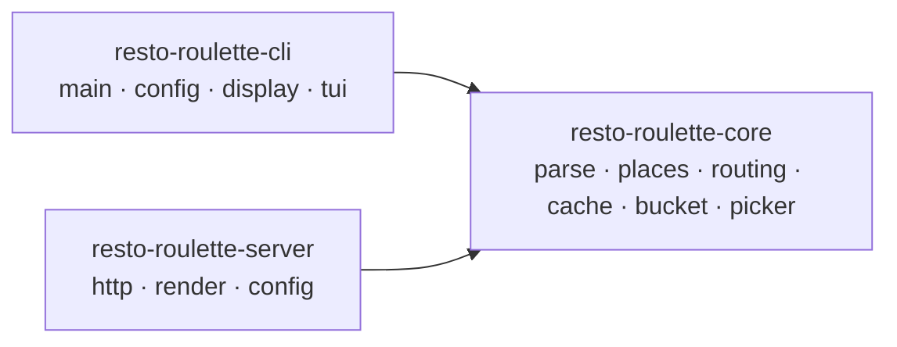
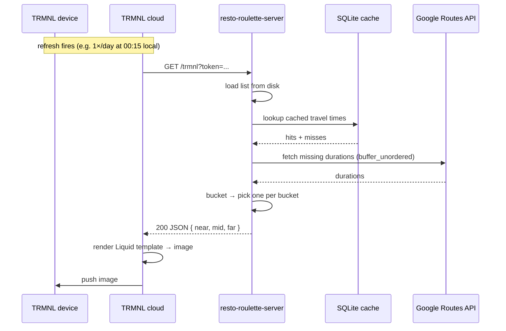

# Design Exploration: `resto-roulette-server` (TRMNL Plugin)

> **Note:** This is an exploratory document for a potential next phase of resto-roulette. It is not a committed roadmap item — scope, timing, and final architecture are undecided. The aim is to map out the shape of the work before any code is written.

## Context

resto-roulette today is a one-shot CLI: run it from a terminal, get a recommendation. The user owns a [TRMNL](https://usetrmnl.com) e-ink display and wants the same three-bucket recommendation surfaced ambiently — visible at a glance, without opening a terminal.

The natural way to do that on TRMNL is a **plugin**: TRMNL polls a URL on a configurable cadence and renders whatever the server returns. This document explores building `resto-roulette-server`, a sibling binary to the existing CLI, that serves the picker output as a TRMNL plugin.

This is also a good moment to factor out the shared core of the project into its own crate, since CLI and server will share most of the pipeline (parse → enrich → route → bucket → pick) and only diverge in their I/O surface.

## Goals (v1)

- A small HTTP server that, on each request, runs the existing pipeline once and returns picks for all three buckets (Near / Mid / Far) shown simultaneously on the e-ink screen.
- Single-tenant: one home address, one restaurant list, one TRMNL device.
- Static restaurant list on disk (same GeoJSON / CSV formats the CLI already understands), with a path forward to dynamic ingestion (see [`list-ingestion-exploration.md`](./list-ingestion-exploration.md)).
- Refactor existing crate into a Cargo workspace so CLI and server share a `resto-roulette-core` library.
- Deployable as a single static binary, suitable for the user's home Raspberry Pi.

## Non-Goals (v1)

- Multi-tenant / per-device config (outlined for the future, not built).
- `--open-now` and `--cuisine` filters on the server (deferred — bucketing only).
- Any interactive UI (no analogue of the TUI; the device has no input surface).
- Server-side caching of picks across requests — every request re-rolls statelessly. Cadence is owned by TRMNL's per-plugin refresh setting.
- Public marketplace listing on TRMNL.

## TRMNL Plugin Model

TRMNL supports several plugin types. The relevant ones for this use case:

| Type | How content gets to the device | Fit |
|---|---|---|
| **Private Plugin (Polling)** | TRMNL polls a URL you control at the configured cadence. The endpoint returns either JSON (rendered through a Liquid template hosted on TRMNL) or pre-rendered markup. | **Recommended.** Matches our model exactly: stateless, server-side generation per refresh. |
| Private Plugin (Webhook) | The server *pushes* data to TRMNL when state changes. | Wrong direction — we have no source-of-truth event to push from; picks are randomized at request time. |
| BYOS (Bring Your Own Server) | Replaces TRMNL's whole rendering pipeline. | Far more than we need; loses TRMNL's templating and refresh-rate management. |

**Refresh cadence.** TRMNL allows per-plugin refresh-rate overrides, including a 1×/day setting that fires at 00:15 local time. Because the server is stateless and re-rolls on every request, cadence is entirely a TRMNL-side configuration. No server-side scheduling required.

References:
- [TRMNL — Compare custom plugin types](https://help.trmnl.com/en/articles/10546870-compare-custom-plugin-types)
- [TRMNL — How refresh rates work](https://help.trmnl.com/en/articles/10113695-how-refresh-rates-work)
- [TRMNL — Private Plugins](https://help.trmnl.com/en/articles/9510536-private-plugins)

## Architecture

### Workspace Layout

The current single-crate layout becomes a Cargo workspace with three members:

```
resto-roulette/
├── Cargo.toml                    # workspace manifest
├── crates/
│   ├── resto-roulette-core/      # library: parse, places, routing, cache, bucket, picker
│   │   └── src/lib.rs
│   ├── resto-roulette-cli/       # current binary (main.rs, config.rs, display.rs, tui/)
│   │   └── src/main.rs
│   └── resto-roulette-server/    # new binary
│       └── src/main.rs
└── docs/
```

What moves into `resto-roulette-core`:

- `parse/` — GeoJSON + CSV parsers (unchanged).
- `places/` — Places API client, hours logic, cuisine taxonomy.
- `routing/` — Routes API client.
- `cache/` — SQLite cache.
- `bucket.rs`, `picker.rs`.
- `error.rs` — variant set may need light surgery so server-only errors don't leak into the CLI binary, and vice versa.

What stays in `resto-roulette-cli`:

- `main.rs`, `config.rs` (file/env/flag resolution is CLI-shaped).
- `display.rs` (terminal formatter).
- `tui/` (interactive view).

What is new in `resto-roulette-server`:

- HTTP server (recommend `axum` — lightweight, well-supported, Tokio-native; we already depend on Tokio).
- Server-shaped config loader (env vars + a server config file at `~/.resto-roulette/server.toml`).
- A renderer that maps `Buckets` → JSON for TRMNL's Liquid template.

### Crate Dependency Graph



### Request Flow



### HTTP Surface (proposed)

| Method | Path | Purpose |
|---|---|---|
| GET | `/trmnl` | The endpoint TRMNL polls. Returns JSON `{ near, mid, far }` for the configured Liquid template. |
| GET | `/healthz` | Liveness probe (200 OK). |

A concrete response shape (subject to revision once the Liquid template is sketched):

```json
{
  "generated_at": "2026-04-26T08:00:00Z",
  "near": { "name": "Hà",         "address": "243 Rue De Bleury", "duration_minutes": 12, "mode": "walk" },
  "mid":  { "name": "Schwartz's",  "address": "...",                "duration_minutes": 22, "mode": "bike" },
  "far":  { "name": "Joe Beef",    "address": "...",                "duration_minutes": 38, "mode": "drive" }
}
```

If a bucket is empty, the field is `null` and the template renders an empty-state line.

### Authentication

The server will be reachable from TRMNL's cloud, so it must be on the public internet (or behind a tunnel TRMNL can reach). Three options:

1. **Shared secret in URL or header.** Server config holds a token; TRMNL sends it as `?token=...` or a header. Trivial, single-user, sufficient against drive-by traffic.
2. **No auth, Tailscale-only.** Pi reachable only on Tailscale; TRMNL would need to be on the same tailnet, which is not how TRMNL operates.
3. **mTLS / OAuth.** Overkill for a single-device, single-user deployment.

**Recommended: shared secret via query param or header.** TRMNL's polling URL config easily accommodates this, and it keeps the server free of session/credential machinery. Pair with HTTPS (Cloudflare Tunnel → Pi, or Caddy on a small VPS) so the secret isn't in plaintext on the wire.

### Deployment

Two viable targets, with the user's existing Raspberry Pi as the primary:

- **Raspberry Pi (recommended).** Cross-compile a static `aarch64-unknown-linux-musl` (or `gnueabihf` depending on Pi model) binary. Expose to the internet via [Cloudflare Tunnel](https://developers.cloudflare.com/cloudflare-one/connections/connect-networks/) — no port-forwarding, free TLS, stable URL for TRMNL to poll. Run under `systemd` for restart-on-failure.
- **Cloud VPS (Fly.io / Railway).** Single-region tiny instance, same binary. Trades the cost of running 24/7 against the operational simplicity of not depending on home internet.

Either deployment runs the same binary. Defer the choice; the architecture doesn't change.

## Future: Multi-Tenant Outline

Out of scope for v1, but the workspace refactor should leave the door open. Sketch of the work involved when/if this is desired:

- **Per-device config store.** Replace the single `server.toml` with a small SQLite table keyed by device ID (or TRMNL's per-plugin token). Each row holds: home address, restaurant list path or URL, refresh-time-zone, optional filter prefs.
- **Tenant-scoped cache.** The `travel_times` table key already includes `SHA-256(home)`, so per-home isolation is free. The `place_details` cache is global and stays that way.
- **Auth.** Move from single shared secret to one-token-per-device, validated against the device table.
- **List management.** A small admin endpoint (or CLI subcommand on the server binary) for CRUD on tenants and their list files. This is also where automated list ingestion (see [`list-ingestion-exploration.md`](./list-ingestion-exploration.md)) plugs in — once a Chrome extension can sync a user's list to a JSON cache, the server can read from each tenant's cache file.
- **Cost controls.** With multiple tenants, Routes/Places API spend scales linearly. Worth adding per-tenant request quotas before opening up.

None of this changes the core crate's API, which is the point of the refactor: the core stays single-tenant by accepting a `home: String` and `list: Vec<Restaurant>` per call.

## Critical Files (when this gets implemented)

- `Cargo.toml` — convert to a workspace manifest.
- `crates/resto-roulette-core/src/lib.rs` — re-export the modules currently under `src/{parse,places,routing,cache,bucket,picker,error}`.
- `crates/resto-roulette-cli/` — current `src/{main.rs,config.rs,display.rs,tui/}` move here unchanged.
- `crates/resto-roulette-server/src/main.rs` — new: axum app, `/trmnl` and `/healthz` handlers, server config loader, JSON renderer.
- `crates/resto-roulette-server/src/render.rs` — new: `Buckets → TrmnlResponse` mapping. Reuses `BucketEntry` from core.
- `RELEASE_NOTES.md` — note the workspace refactor as an internal change; note the new server binary as a user-facing addition.

Functions / utilities to **reuse** from core (no duplication):

- The parsers under `parse::` (file → `Vec<Restaurant>`).
- The Routes API client and the `buffer_unordered(10)` orchestration in the current `main.rs` pipeline (this orchestration likely wants to move *into* core as `pipeline::run(...)` so both binaries call it).
- `cache::Cache::open` with the existing TTLs.
- `bucket::assign` and `picker::pick_one_random`.

The orchestration extraction (current `main.rs` body → `core::pipeline::run`) is the single most important refactor: it's what lets the server stay tiny and the CLI shrink to argument parsing + display.

## Verification

How to validate this end-to-end once built:

1. **Workspace builds.** `cargo build --workspace` and `cargo test --workspace` both pass; existing CLI tests stay green after the move.
2. **CLI parity.** `cargo run -p resto-roulette-cli -- --list ... --home ...` produces identical output to the pre-refactor binary on the same fixtures. The TUI still launches under the existing conditions.
3. **Server smoke test.** `cargo run -p resto-roulette-server` then `curl 'http://localhost:8080/trmnl?token=XXX'` returns a well-formed JSON body with three (or fewer) bucket entries.
4. **TRMNL integration.** Configure a Private Plugin pointing at the deployed URL, set refresh to 1×/day, force-refresh from the TRMNL UI, and confirm the e-ink display renders all three picks. Force-refresh a second time and confirm a different selection appears (statelessness).
5. **Pi deployment.** Cross-compiled binary runs under `systemd` on the Pi; Cloudflare Tunnel exposes a stable HTTPS URL; reboot the Pi and confirm the service comes back without manual steps.
